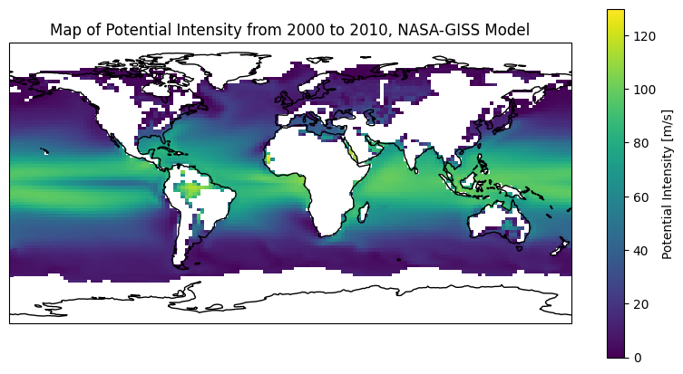
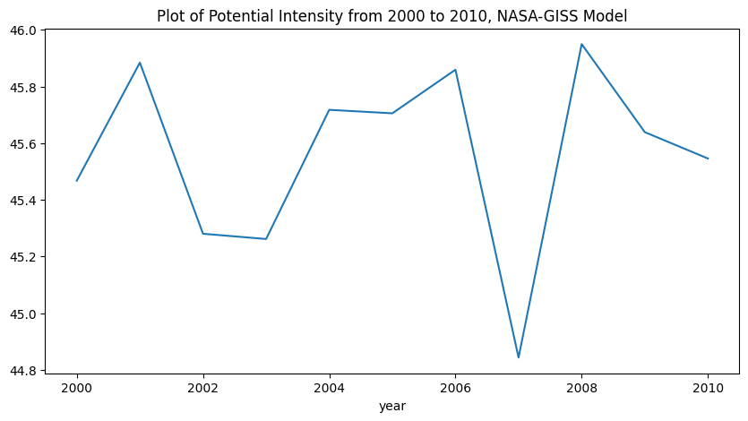
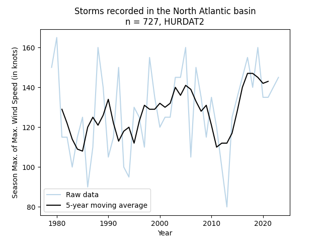
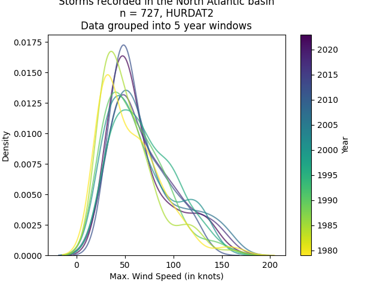
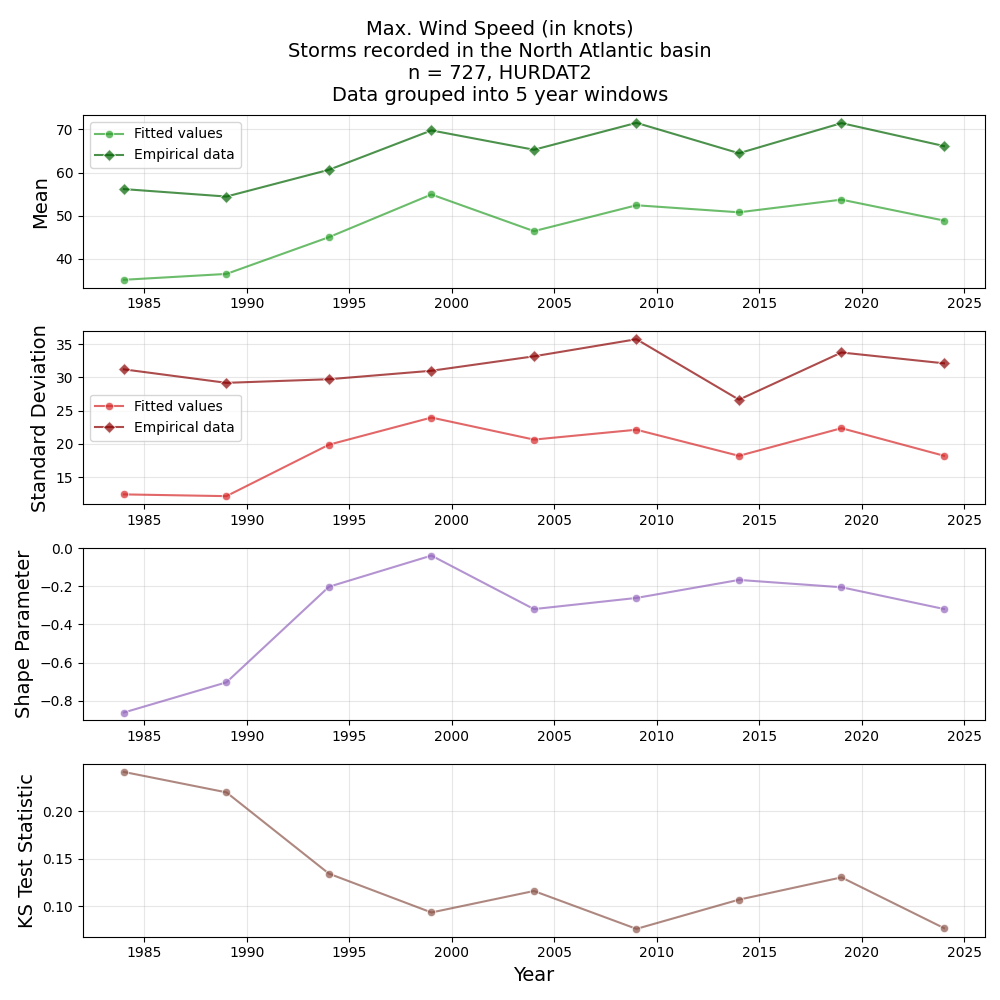

# Simulating Maximum Potential Intensity of Tropical Cyclones Using CMIP6 Climate Models


## Contributors

- Max Bahar
- Kent Codding
- Abigail Kinaro

## Project Details

This project examines how maximum potential intensity (PI), a theoretical upper limit on tropical cyclone strength, evolves under different climate scenarios in the Gulf of Mexico. Using data from the Coupled Model Intercomparison Project Phase 6 (CMIP6) and the pyPI Python library, we calculate PI based on key climate variables, including sea surface temperature, atmospheric temperature, mixing ratios, and sea-level pressure. Results show that PI increases across all Shared Socioeconomic Pathway (SSP) scenarios, with the most severe scenario, SSP5-8.5, exhibiting the highest rates of intensification. Spatial analysis reveals stronger PI increases in the southern region of the Gulf of Mexico, corresponding to regions of higher sea surface temperatures. Our findings emphasize the persistent risk of stronger tropical cyclones, even under conservative estimates of climate conditions, and highlight the importance of further validation using empirical data and additional model ensemble members.

# Library

For more information on the library classes and methods, please consult the [documentation](https://code.harvard.edu/pages/AM215/final_77/).
Usage of the library to generate the plots in our reports is in src/notebooks/

## Requirements

Using this library requires python version 3.12.x.

Please see `pyproject.toml` or `requirements.txt` for a full list of dependencies.

The major requirements are:

- geopandas
- intake-esm
- matplotlib
- numpy
- pandas
- rasterio
- seaborn
- tcpypi
- tropycal
- xarray

## Installation

To install, please follow the steps below:
1. Copy (clone or fork) the GitHub repo locally.

```bash
git clone [your-preferred-github-url]
```

2. Open a command line and make the root directory of the repo the current directory.

```bash
cd ~/final_77/
```

3. Create a new virtual environment with your favorite package manager using `python=3.12`. **Note: It's important to use Python version 3.12 or older.** An example using micromamba is shown below:

```bash
micromamba create -n env-name python=3.12 -c conda-forge
```

4. Activate the virtual environment and install [poetry](https://python-poetry.org/):

```bash
micromamba activate env-name
pip install poetry
```

5. Use `poetry` to install all dependencies.

```bash
poetry install
```

## `tc_potential` Module

### Overview

The `tc_potential` library allows users to fetch climate model data from the 6th Coupled Model Intercomparison Project (CMIP6) using the `CMIP6DataFetcher` class. The `DistributedManager` class can be used to enable parallel computing for faster computation. Finally, the `PIAnalysis` class can be used to calculate maximum potential intensity using the fetched climate model data, specifying spatial and temporal limits, and visualize results using the plotting functions.

### Usage

#### Importing the Module

```python
from tc_potential import CMIP6DataFetcher, DistributedManager, PIAnalysis
```

#### `CMIP6DataFetcher` Class

Initialize the class instance.

```python
data_fetcher = CMIP6DataFetcher()
```

##### `fetch_data`

```python
nasa_ds_dict = data_fetcher.fetch_data(
    institution_id="NASA-GISS",
    source_id="GISS-E2-1-G",
    experiment_id="historical",
    member_id="r1i1p3f1",
    grid_label="gn"        
)
cmip6_ds = nasa_ds_dict["CMIP.NASA-GISS.GISS-E2-1-G.historical.Amon.gn"]
```

#### `DistributedManager` Class

Using `DistributedManager` is optional but recommended to enable parallel computing and decrease runtime.

Initializing the class instance starts a Dask client which handles the parallelized computations.

```python
dist_manager = DistributedManager()
```

##### `close`

Once done with the complex computations, you can shut down the Dask cluster using the `close` method.

```python
dist_manager.close()
```

#### `PIAnalysis` Class

Initialize the class instance.

```python
pi_analysis = PIAnalysis()
```

##### `convert_variables`

This static method converts CMIP6 data to a format compatible with the `tcpypi` library for potential intensity calculation.

```python
env_ds = pi_analysis.convert_variables(cmip6_ds)
```

##### `calculate_pi`

This static method calculates potential intensity, leveraging the `tcpypi` library.

```python
pi_ds = pi_analysis.calculate_pi(env_ds)
```

##### `set_data`

Sets the data attributes for the `PIAnalysis` class instance, allowing spatial and temporal limits to be set.

This method converts variables using `convert_variables` by default.

```python
pi_analysis.set_data(cmip6_ds, year_mon_limits=["1990-01", "1999-12"])
```

##### `analyze_pi`

Calculates potential intensity values for the data attribute set using `set_data`.

```python
pi_ds = pi_analysis.analyze_pi()
```

##### `calculate_mean`

Calculates the spatial mean of the environmental and potential intensity variables.

```python
mean_df = pi_analysis.calculate_mean()
```

##### `fit_mean_trends`

Fits linear trendlines to the spatial mean values of the variables.

```python
params_df = pi_analysis.fit_mean_trends()
```

##### `plot_map`

Plots a map of the specified variable.

```python
fig, ax = plt.subplots()
pi_analysis.plot_map("vmax", ax=ax)
```

##### `plot_mean`

Plots a line chart of the specified variable's spatial mean over time, allows specification of a moving average window. By default, data are monthly averages.

```python
fig, ax = plt.subplots()
pi_analysis.plot_mean("vmax", yearly_window=1, ax=ax)
```

#### Full Workflow Example

```python
# IMPORT CLASSES

import matplotlib.pyplot as plt
from tc_potential import CMIP6DataFetcher, DistributedManager, PIAnalysis

# FETCH DATA:

# Initialize data fetcher
data_fetcher = CMIP6DataFetcher()

# Fetch historical simulation data from the NASA-GISS model
nasa_ds_dict = data_fetcher.fetch_data(
    institution_id="NASA-GISS",
    source_id="GISS-E2-1-G",
    experiment_id="historical",
    member_id="r1i1p3f1",
    grid_label="gn"        
)
cmip6_ds = nasa_ds_dict["CMIP.NASA-GISS.GISS-E2-1-G.historical.Amon.gn"]

# SETUP PARALLEL COMPUTING:

# Initializes distributed computing
dist_manager = DistributedManager()

# ANALYZE SIMULATION DATA:

# Initialize class for analysis
pi_analysis = PIAnalysis()

# Set the data to analyze
pi_analysis.set_data(cmip6_ds, year_mon_limits=["2000-01", "2010-12"])

# Calculate potential intensity variables
pi_ds = pi_analysis.analyze_pi()

# Calculate spatial mean of variables
mean_df = pi_analysis.calculate_mean()

# Fit trendlines to variables
params_df = pi_analysis.fit_mean_trends()

# VISUALIZE RESULTS:

# Plots a map of the potential intensity
fig, ax = plt.subplots(figsize=(10,5))
pi_analysis.plot_map(
    variable="vmax", 
    plot_title="Map of Potential Intensity from 2000 to 2010, NASA-GISS Model", 
    ax=ax
)

# Plots a line chart of potential intensity over time
fig, ax = plt.subplots(figsize=(10,5))
pi_analysis.plot_mean(
    variable="vmax", 
    plot_title="Plot of Potential Intensity from 2000 to 2010, NASA-GISS Model", 
    yearly_window=1, 
    ax=ax
)

# CLEAN UP:

# Closes the distributed computing cluster(s)
dist_manager.close()
```

#### Example Plots

Following the workflow above should yield the following plots:




## `tc_extremes` Module

### Overview

The `tc_extremes` library allows users to examine historical storm data from the HURDAT2 and IBTrACS datasets using extreme value theory (EVT). 
This library provides functionality to fit variables such as maximum wind speed and minimum central pressure to the Generalized Extreme Value (GEV) distribution. 
It includes methods for data fetching, fitting GEV parameters, evaluating fits, scoring fits with statistical tests, and visualizing results.

### Usage

#### Importing the Module

```python
from tc_extremes import TCExtremes
```

#### `TCExtremes` Class

Initialize the class instance.

```python
tce = TCExtremes()
```

##### `fetch`

Fetches storm data for a specific ocean basin and timeframe.

```python
storm_data = tce.fetch(start_year=2000, end_year=2020, ocean_basin='north_atlantic')
```

##### `fit`
Fits the GEV distribution to the specified variable (`vmax` for wind speed, `mslp` for pressure). Specify `fit_window` to group data into periods of `fit_window` years and fit GEV distribution to each period.

```python
gev_params = tce.fit(variable='vmax', fit_window=5)
```

##### `evaluate`
Evaluates the GEV fit by comparing GEV probabilities with empirical data.

```python
evaluation_results = tce.evaluate(variable='vmax', ev_params=gev_params)
```

##### `score`
Scores the GEV fit using the Kolmogorov-Smirnov test.

```python
ks_results = tce.score(variable='vmax', ev_params=gev_params)
```

##### `plot_fit`

Plots the fitted GEV distribution.

```python
tce.plot_fit(variable='vmax', ev_params=gev_params)
```

##### `plot_agg`

Plots the moving average of the annual maximum/minimum over time.

```python
tce.plot_agg(variable='vmax', window=10)
```

##### `plot_dist`
Plots the kernel density of the data over specified time periods.

```python
tce.plot_dist(variable='vmax', window=5)
```

##### `plot_time`
Plots empirical mean, standard deviation, and fitted GEV parameters over time.

```python
tce.plot_time(variable='vmax', ev_params=gev_params)
```

#### Full Workflow Example

```python
# IMPORT LIBRARY:

from tc_extremes import TCExtremes

# FETCH DATA:

# Initialize the class
tce = TCExtremes()
# Fetch all available data for the North Atlantic
storm_data = tce.fetch(start_year=1979, end_year=2023, ocean_basin='north_atlantic')

# ANALYZE EMPIRICAL DATA:

# Plot 5-year moving average of maximum wind speeds
tce.plot_agg(variable='vmax', window=5, min_periods=5)
# Plot the distribution of maximum wind speeds in 5-year windows
tce.plot_dist(variable='vmax', window=5)

# FIT GEV DISTRIBUTION TO DATA:

# Fit the GEV distribution to 5-year time windows only for storms after 1979
ev_params = tce.fit(variable='vmax', fit_window=5)
# Plot the fit for all the time windows
tce.plot_fit(variable='vmax', show_plot=True)
# Compare differences between theoretical and empirical distribution
eval_results = tce.evaluate(variable='vmax')
# Use KS test statistic to score fit
ks_results = tce.score(variable='vmax')
# Plot the parameters over time
tce.plot_time(variable='vmax')
```

#### Example Plots

Following the workflow above should yield the following plots:





.png)


